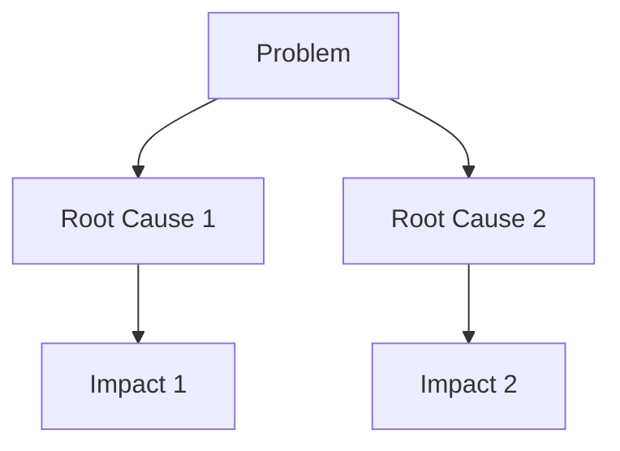
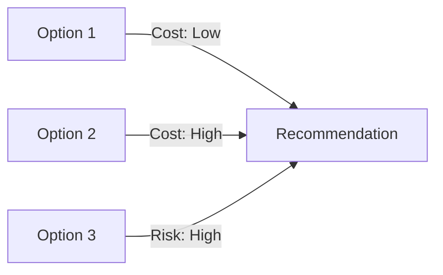

# Work Report PPT Generator (English Output)

This skill provides structured guidance for creating professional work report presentations in English using the SCQA framework (Situation, Complication, Question, Answer) with emphasis on solution comparison for leadership decision-making. **All reports use compact format: 1 page for simple reports, 1-2 pages for complex reports.**

## Workflow Overview

### Step 1: Determine Template Format

**Ask the user:**
- "Do you have a company-specified PPT template to use?"
- If yes, get the template file path or request user to place it in `assets/`
- If no, use the default professional template

**Action:**
- Check if `assets/company-template.pptx` exists
- If not, use default styling defined in the script

### Step 2: Determine Report Type

**Ask the user:**
- "Is this a simple or complex problem report?"
- Simple = **1 page only** (Executive Summary + Problem + Solutions + Recommendation)
- Complex = **1-2 pages** depending on content density
  - 1 page: Concise analysis where all content fits comfortably
  - 2 pages: Detailed analysis with more extensive comparison or diagrams

**Standard configurations:**

| Report Type | Slide Count | Structure |
|------------|-------------|-----------|
| Simple | 1 slide | All-in-one: Title + Analysis + Solutions + Recommendation |
| Complex | 1-2 slides | Slide 1: Problem + Solutions | Slide 2 (optional): Recommendation + Decision |

### Step 3: Gather Problem Information

**Collect the following information from the user:**

1. **Problem Description (What is the issue?)**
   - Clear statement of the problem
   - When it started
   - Who is affected

2. **Root Cause Analysis (Why is this happening?)**
   - Primary cause
   - Contributing factors
   - Any data/evidence supporting analysis

3. **Conflict Points (What makes this urgent?)**
   - Business impact
   - Timeline constraints
   - Resource limitations
   - Risks if not addressed

4. **Images (Optional)**
   - Ask: "Do you have any charts, graphs, or screenshots to include?"
   - Get image file paths
   - Specify where each image should be placed

**Summarize and validate:**
- Present the collected information back to the user
- "Based on what you've shared, here's the summary of the problem. Is this accurate?"

### Step 4: Identify Multiple Solution Options

**Ask the user:**
- "What are the potential solutions you've considered?"
- "How many options should be presented? (Recommended: 2-3 options for comparison)"

**For each solution option, gather:**

1. **Solution Description** - What does this solution involve?
2. **Pros (Benefits)** - Advantages of this approach
3. **Cons (Drawbacks)** - Disadvantages or risks
4. **Resources Required** - Budget, time, people needed
5. **Timeline** - How long to implement
6. **Expected Outcomes** - What results to expect

### Step 5: Generate Decision-Making Slide

**Create a structured comparison for leadership:**

```
Solution Comparison Summary
├── Option 1: [Name]
│   ├── Pros: [2-3 key benefits]
│   ├── Cons: [1-2 key drawbacks]
│   ├── Cost: [Amount]
│   └── Timeline: [Duration]
├── Option 2: [Name]
│   ├── Pros: [2-3 key benefits]
│   ├── Cons: [1-2 key drawbacks]
│   ├── Cost: [Amount]
│   └── Timeline: [Duration]
└── Recommendation: [Which option and why]
```

### Step 6: Generate English PPT

Use the Python script to generate the final presentation with all content in English.

**Before generating, assess whether diagrams would enhance understanding:**
- For complex problems with multiple factors → Generate root cause diagram
- For comparing solutions with trade-offs → Generate comparison matrix
- For implementation plans → Generate timeline/roadmap diagram

**Decision framework for diagram inclusion:**
1. Is the problem multi-faceted? → Yes → Include diagram
2. Can it be explained in <3 sentences? → Yes → Skip diagram
3. Will the diagram fit within page limits? → Yes → Include diagram

## SCQA Framework (Compact)

The compact SCQA framework for single/double-page decision-making presentations:

1. **Situation (现状)** - Current context, baseline state
2. **Complication (冲突)** - The problem, impact, and urgency
3. **Root Cause Analysis (原因分析)** - Why is this happening?
4. **Question (问题)** - The key decision to be made
5. **Solution Options (潜在方案)** - Multiple alternatives with pros/cons
6. **Recommendation (推荐方案)** - Recommended approach with justification

## Standard PPT Structure (Compact Format)

### For Simple Reports (1 Page - 1 Slide)

All content on a single slide using compact layout:

```
┌─────────────────────────────────────────────────────────────┐
│              [Report Title]                               │
│         Presenter: [Name] | Date: [Date]               │
├─────────────────────────────────────────────────────────────┤
│  Executive Summary                                         │
│  • [Key finding 1]                                      │
│  • [Key finding 2]                                      │
│  • [Key finding 3]                                      │
├─────────────────────────────────────────────────────────────┤
│  Problem & Root Cause                                     │
│  Problem: [1-line description]                              │
│  Root Cause: [Primary cause]                               │
│  Impact: [1-line impact statement]                          │
├─────────────────────────────────────────────────────────────┤
│  Solution Options (Compact)                                 │
│  ┌──────────────┬──────────────┬──────────────┐      │
│  │ Option 1    │ Option 2    │ Option 3    │      │
│  │ [Brief]      │ [Brief]      │ [Brief]      │      │
│  │ Cost: $X     │ Cost: $X     │ Cost: $X     │      │
│  └──────────────┴──────────────┴──────────────┘      │
├─────────────────────────────────────────────────────────────┤
│  Recommendation                                          │
│  Recommended: [Option X]                                 │
│  Justification: [1-2 lines]                              │
│  Decision Required: [What to approve, by when]                  │
└─────────────────────────────────────────────────────────────┘
```

### For Complex Reports (1-2 Pages - 1-2 Slides)

**Use 1 slide when:** The problem analysis and solutions can be summarized concisely within space constraints.

**Use 2 slides when:** More detailed analysis is needed, or when the problem requires extensive solution comparison with diagrams.

**Slide 1: Problem Analysis & Solutions**

```
┌─────────────────────────────────────────────────────────────┐
│              [Report Title]                               │
│         Presenter: [Name] | Date: [Date]               │
├─────────────────────────────────────────────────────────────┤
│  Executive Summary                                         │
│  • [Key finding 1]                                      │
│  • [Key finding 2]                                      │
│  • [Key finding 3]                                      │
├─────────────────────────────────────────────────────────────┤
│  Problem Analysis                                         │
│  Situation: [2-3 bullet points]                            │
│  Problem: [1-2 lines]                                    │
│  Root Cause: [2-3 bullet points]                         │
│  Impact: [1-2 lines]                                     │
├─────────────────────────────────────────────────────────────┤
│  Solution Options                                         │
│  Option 1: [Name]                    Option 2: [Name]    │
│  Pros: 2-3 points                    Pros: 2-3 points   │
│  Cons: 1-2 points                    Cons: 1-2 points   │
│  Cost: $[Amount]                       Cost: $[Amount]      │
│  Timeline: [X weeks]                   Timeline: [X weeks]  │
│                                                          │
│  [Image/Chart if provided]                                │
└─────────────────────────────────────────────────────────────┘
```

**Slide 2: Recommendation & Decision**

```
┌─────────────────────────────────────────────────────────────┐
│              Recommendation                                │
├─────────────────────────────────────────────────────────────┤
│  Recommended: [Option Name]                              │
│                                                          │
│  Justification:                                          │
│  • [Reason 1]                                            │
│  • [Reason 2]                                            │
│  • [Reason 3]                                            │
│                                                          │
│  Risk Mitigation:                                         │
│  • [Risk 1 mitigation]                                     │
│  • [Risk 2 mitigation]                                     │
├─────────────────────────────────────────────────────────────┤
│  Implementation Plan (Brief)                              │
│  • [Action 1] - [Timeline]                               │
│  • [Action 2] - [Timeline]                               │
│  • [Action 3] - [Timeline]                               │
├─────────────────────────────────────────────────────────────┤
│              Decision Required                                │
│                                                          │
│  Please approve: [Specific request]                           │
│                                                          │
│  Decision Deadline: [Date]                                  │
│  Required Approval: [Role/Person]                              │
└─────────────────────────────────────────────────────────────┘
```

## Diagram Generation Guidelines

### When to Generate Diagrams

Generate visual diagrams to enhance understanding in the following scenarios:

1. **Problem Visualization**
   - When the problem involves multiple interconnected factors
   - When showing a process flow that breaks down
   - When visualizing system architecture or data flow issues
   - When comparing "before" vs "after" states

2. **Root Cause Analysis**
   - When there are multiple contributing factors
   - When showing causal relationships (fishbone/Ishikawa diagram style)
   - When mapping a timeline of events leading to the problem
   - When illustrating a chain reaction effect

3. **Solution Comparison**
   - When comparing complex multi-dimensional solutions
   - When showing trade-offs between cost, time, and quality
   - When mapping solution implementation phases
   - When visualizing resource allocation across options

4. **Decision Framework**
   - When presenting a decision matrix with weighted criteria
   - When showing risk assessment heatmaps
   - When illustrating implementation roadmap
   - When mapping dependencies between actions

### Diagram Types to Generate

Based on the problem context, generate appropriate diagrams:

**Text-based diagrams** (suitable for markdown/text output):
- ASCII/Unicode diagrams for simple flows
- Tree structures for hierarchical information
- Matrix tables for comparison
- Timeline representations

**Mermaid diagram syntax** (if markdown supports):




### Diagram Placement Guidelines

| Section | Diagram Purpose | Example |
|---------|----------------|---------|
| Problem | Visualize the issue and its scope | Process flow showing breakdown point |
| Root Cause | Show causal relationships | Fishbone diagram or cause tree |
| Solution Options | Compare options side-by-side | Comparison matrix or trade-off chart |
| Recommendation | Show implementation path | Roadmap or action flow diagram |
| Decision | Clarify what needs approval | Decision matrix with criteria |

### When NOT to Generate Diagrams

- For extremely simple, linear problems
- When the problem can be fully explained in 2-3 sentences
- When adding a diagram would exceed page/character limits
- When the user has not requested or would not benefit from visual aids

### Example Diagram Formats

**Process Flow Diagram:**
```
Current State
    ↓
[Bottleneck/Problem Point]
    ↓
Degraded Performance
```

**Solution Comparison Matrix:**
```
          | Cost | Time | Quality | Risk
----------|------|------|---------|------
Option 1  | Low  | Fast | High    | Low
Option 2  | Med  | Med  | High    | Med
Option 3  | High | Slow | Very High| High
```

**Implementation Roadmap:**
```
Phase 1: Immediate (Week 1-2)
├── Action A
└── Action B

Phase 2: Short-term (Month 1)
├── Action C
└── Action D

Phase 3: Long-term (Month 2-3)
└── Action E
```

## Content Guidelines (English Output - Compact)

### Problem Description
- Use clear, concise language (1-2 sentences maximum)
- Quantify impact with specific numbers
- Include timeline (when it started)
- State who is affected

### Root Cause Analysis
- Identify primary cause first
- List 2-3 contributing factors (bullet points)
- Support with data if available
- Be objective and factual

### Solution Options (Compact Format)
- Present 2-3 options (optimal for decision-making)
- For each option (maximum 2-3 lines per option):
  - Name (short)
  - 2 pros (single line each)
  - 1 con (single line)
  - Cost (brief)
  - Timeline (brief)
- Use table or side-by-side layout for comparison

### Recommendation
- Be explicit about which option is recommended
- Provide 2-3 reasons for the choice (1 line each)
- Address potential objections
- Include risk mitigation if needed

### Images
- Ask user if they have charts, graphs, or screenshots
- Accept image file paths (.png, .jpg, .jpeg, .gif)
- Insert images at appropriate positions:
  - After Problem section
  - In Solution Comparison
  - Supporting Recommendation

## Writing Style for Slides (Compact)

- Write in **business English**
- Use active voice
- Start bullets with action verbs
- Keep sentences short and direct
- Use specific numbers, not vague descriptions
- **Be concise - every character counts**
- Use abbreviations where appropriate
- Eliminate filler words

## Solution Comparison Format (Compact)

Use structured comparison in table format:

```
┌─────────────────┬─────────────────┬─────────────────┐
│  Option 1      │  Option 2      │  Option 3      │
├─────────────────┼─────────────────┼─────────────────┤
│ [Name]         │ [Name]         │ [Name]         │
│                 │                 │                 │
│ Pros:           │ Pros:           │ Pros:           │
│ • [1 line]      │ • [1 line]      │ • [1 line]      │
│ • [1 line]      │ • [1 line]      │ • [1 line]      │
│                 │                 │                 │
│ Cons:           │ Cons:           │ Cons:           │
│ • [1 line]      │ • [1 line]      │ • [1 line]      │
│                 │                 │                 │
│ Cost: $[X]     │ Cost: $[X]     │ Cost: $[X]     │
│ Time: [X weeks] │ Time: [X weeks] │ Time: [X weeks] │
└─────────────────┴─────────────────┴─────────────────┘
```

## Generating the PPT

### Using the Python Script

The `scripts/generate_ppt.py` script automates PPT generation with image support:

```bash
python scripts/generate_ppt.py --input content.md --output report.pptx --template company-template.pptx
```

**Input format (Markdown):**
```markdown
# Report Title

Presenter: Your Name
Date: 2024-03-15
Report Type: simple

## Executive Summary
- Key finding 1
- Key finding 2
- Recommended: [Solution Name]

## Situation
- Current state point 1
- Current state point 2

## Complication
- Problem statement
- Impact details

## Root Cause
- Primary cause
- Contributing factor 1
- Contributing factor 2

## Key Question
What is the best approach to [solve the problem]?

## Solution Options

### Option 1: [Solution Name]
Description: [Brief description]
Pros:
- Benefit 1
- Benefit 2
Cons:
- Risk 1
- Risk 2
Cost: $[Amount]
Timeline: [Time period]

### Option 2: [Solution Name]
Description: [Brief description]
Pros:
- Benefit 1
- Benefit 2
Cons:
- Risk 1
- Risk 2
Cost: $[Amount]
Timeline: [Time period]

## Recommendation
Recommended: [Solution Name]
Justification:
- Reason 1
- Reason 2
- Reason 3

## Next Steps
- Action item 1 - Owner - Timeline
- Action item 2 - Owner - Timeline

## Decision Required
[What leadership needs to approve and by when]

## Images
[Optional: Add image paths for insertion]
Image1: path/to/chart1.png
Image2: path/to/chart2.png
```

**Image insertion:**
- Use `## Images` section in Markdown
- Each line: `Image[N]: path/to/image.png`
- Images will be placed in appropriate sections

### Template Support

**To use company template:**
1. Place company template in `assets/company-template.pptx`
2. Add `--template` parameter to script command

**Default template features:**
- Professional color scheme (corporate blue/gray)
- Arial font family
- Compact slide layouts
- Optimized for 16:9 aspect ratio

## User Interaction Workflow

### Initial Setup

```
User: "Create a work report PPT for the system performance issue"

You: "I'll help you create a work report PPT. Let me gather some information:

1. Do you have a company-specified PPT template to use?
2. Is this a simple or complex problem report?
   - Simple: 1-page report (all content on one slide)
   - Complex: 1-2 page report (detailed analysis - I'll determine if 1 or 2 pages based on content density)

Let's start with the problem information..."
```

### Information Gathering

```
You: "Please provide the following information:

1. **Problem Description**: What is the issue?
2. **Root Cause**: Why is this happening?
3. **Impact**: How is this affecting the business?
4. **Timeline**: When did this start?

Keep it concise - we're fitting everything on 1-2 pages.

Example format:
Problem: System response time increased from 500ms to 3200ms
Root Cause: Database query inefficiency + lack of caching
Impact: 35% increase in cart abandonment, $50K/week loss
Timeline: Started 2 weeks ago during promotional event
```

### Solution Options Gathering (Compact)

```
You: "Now let's identify solution options.

What potential solutions have you considered? Please provide 2-3 options.

For each option, I need (keep it brief):
- Solution name
- Brief description (1 line)
- 2 key benefits (1 line each)
- 1 key risk (1 line)
- Cost
- Implementation timeline

Example:

Option 1: Redis Cache
Description: Add Redis caching layer
Pros:
• 70% faster queries
• Low cost
Cons:
• Additional infrastructure
Cost: $15K
Timeline: 2 weeks"
```

### Image Gathering

```
You: "Do you have any charts, graphs, or screenshots to include?

If yes, please provide the file paths for:
- Problem visualization (charts showing the issue)
- Solution comparison (comparison chart)
- Supporting evidence (any relevant images)

Images will be placed in the appropriate sections of the PPT."
```

### Confirmation and Generation

```
You: "Based on the information provided, here's the summary:

**Problem**: [summary - 1-2 lines]
**Root Causes**: [summary - 1-2 lines]
**Impact**: [summary - 1 line]
**Solution Options**:
1. [Option 1 - brief summary]
2. [Option 2 - brief summary]
3. [Option 3 - brief summary]

**Recommended**: [Option X] - [brief justification]

Is this accurate? Should I proceed to generate the 1-page PPT?"
```

## Additional Resources

### Reference Files
- **`references/scqa-framework.md`** - Detailed SCQA methodology and examples
- **`references/slide-best-practices.md`** - Slide design and content guidelines
- **`references/solution-comparison.md`** - Best practices for solution comparison slides

### Script Files
- **`scripts/generate_ppt.py`** - Python script for automated PPT generation from Markdown with image support

### Asset Files
- **`assets/company-template.pptx`** - Company-specified template (optional)
- **`assets/images/`** - Directory for report images (optional)

## Quality Checklist

Before finalizing the PPT:

**Content:**
- [ ] All content is in professional English
- [ ] Problem is clearly described (1-2 lines)
- [ ] Root cause analysis is included
- [ ] Impact is quantified
- [ ] 2-3 solution options presented
- [ ] Each option has pros and cons (brief)
- [ ] Recommendation is clear
- [ ] Decision point is explicit
- [ ] Diagrams included when beneficial to understanding
- [ ] Diagrams are placed in appropriate sections

**Structure:**
- [ ] Follows SCQA framework
- [ ] Slide count matches report type (simple=1, complex=1 or 2 based on content)
- [ ] Content fits within page limit (simple=1, complex=1-2 pages)
- [ ] Flows logically from problem → solutions → recommendation
- [ ] Compact and concise formatting

**Design:**
- [ ] Text is readable (20pt minimum body)
- [ ] Consistent formatting throughout
- [ ] No information overload per slide
- [ ] Uses company template if available
- [ ] Images properly placed and sized

## Common Mistakes to Avoid

**Content Mistakes:**
- ❌ Too much text (remember: 1-2 pages total)
- ❌ Presenting only one solution option
- ❌ Not including pros and cons for each option
- ❌ Vague problem description without quantification
- ❌ Missing root cause analysis
- ❌ Unclear recommendation or no recommendation at all

**Structure Mistakes:**
- ❌ Exceeding page limit (simple=1, complex=1-2 pages max)
- ❌ Using 2 pages when 1 page suffices (complex report)
- ❌ Buried lead (recommendation hidden at end)
- ❌ Missing decision point for leadership
- ❌ Inconsistent comparison format across options
- ❌ Not utilizing compact layout effectively

**Language Mistakes:**
- ❌ Mixed English and Chinese content
- ❌ Using idioms or unclear expressions
- ❌ Inconsistent terminology
- ❌ Passive voice throughout
- ❌ Wordy descriptions

## Example Scenarios

**Example 1: Simple Performance Issue Report (1 Page)**

Problem: Database response time increased from 200ms to 1.5s
Root Cause: Missing indexes on frequently queried tables
Impact: User satisfaction dropped 15%, complaints up 200%
Timeline: Issue began 3 weeks ago

Solution Options:
1. Add Indexes (Recommended)
   - Pros: Low cost, quick implementation
   - Cons: Need downtime
   - Cost: $5K
   - Timeline: 1 week

2. Upgrade Hardware
   - Pros: No downtime
   - Cons: High cost
   - Cost: $50K
   - Timeline: 2 weeks

Recommendation: Option 1 - Add Indexes (lower cost, addresses root cause)

---

**Example 2: Complex Cost Reduction Report (1-2 Pages)**

Problem: Monthly operational costs exceeded budget by 25%
Root Cause: Third-party services, redundant licenses, inefficient resources
Impact: $300K monthly overspend, affecting profitability
Timeline: Issue identified over past 6 months

Solution Options:
1. Audit Subscriptions (Recommended)
   - Pros: $200K/month savings, sustainable
   - Cons: Coordination required
   - Cost: $20K
   - Timeline: 2 months

2. Re-negotiate Contracts
   - Pros: Long-term savings
   - Cons: Time-intensive
   - Cost: $50K
   - Timeline: 6 months

3. Freeze New Spend
   - Pros: Quick implementation
   - Cons: Not sustainable
   - Cost: Minimal
   - Timeline: Immediate

Recommendation: Option 1 - Audit Subscriptions (best ROI, sustainable)
Decision Required: Approve $20K budget for audit by March 22
